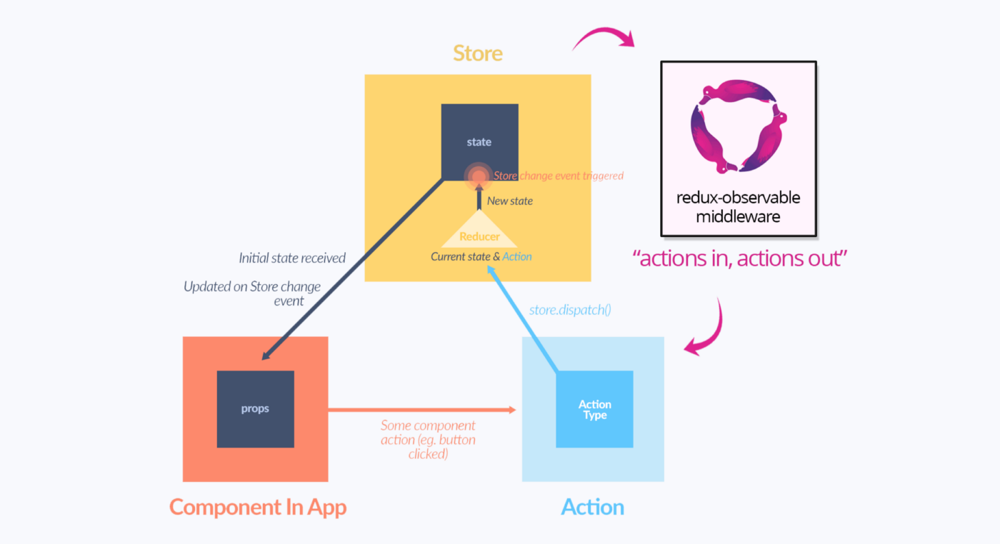

# RxJS

RxJS(Reactive Extensions for JavaScript)是一个基于可观测数据流在异步编程应用中的库, 提供了强大的数据流组合与控制能力。

## RxJS实现的维基百科搜索示例，与Auto-Suggest组件相似
```
var $input = $('#input'),
    $results = $('#results');
/* 只从 keyup 事件获得输入值 */
var keyups = Rx.Observable.fromEvent($input, 'keyup')
    .map(e => e.target.value)
    .filter(text => text.length > 2);
/* 函数节流输出设置为 500ms */
var throttled = keyups.throttle(500 /* ms */);
/* 现在判断值是否有改变，只获取不同的值 */
var distinct = throttled.distinctUntilChanged();

function searchWikipedia (term) {
    return $.ajax({
        url: 'http://en.wikipedia.org/w/api.php',
        dataType: 'jsonp',
        data: {
            action: 'opensearch',
            format: 'json',
            search: term
        }
    }).promise();
}

//不同的节流输入绑定在一起，然后查询服务
var suggestions = distinct.flatMapLatest(searchWikipedia);

suggestions.subscribe(data => {
    var res = data[1];
    /* Do something 像数据绑定 */
    $results.empty();
    $.each(res, (_, value) => $('<li>' + value + '</li>').appendTo($results));
}, error => {
    /* handle any errors */
    $results.empty();
    $('<li>Error: ' + error + '</li>').appendTo($results);
});
```

## 基本概念
  - Reactive Programming 响应式编程
    在Reactive的理念中，我们定义的不是一次性赋值过程，而是可重复的赋值过程，或者说是变量之间的关系：
  ```
  a = b + c
  // 在Reactive的理念
  a: = b + c
  ```
    定义出这种关系之后，每次b或者c产生改变，这个表达式都会被重新计算。不同的库或者语言的实现机制可能不同，写法也不完全一样，但理念是相通的，都是描述出数据之间的联动关系。

    响应式编程是一种完全不同的编程风格。
  > 响应式编程是个令人发狂的编程范式，不过你可以这么理解它：就像是你先安装好管道，但还没有水流过管道，等到将来某个人发起了一个action，然后潺潺流水就来了，你的管道就开始运作了。

  - Stream-based  
    万物皆流（Everything is Stream）
    我们可以把一切输入都当做数据流来处理，比如说：
    - 用户操作
    - 网络响应
    - 定时器
    - Worker

  - Observable  
    RxJS 是基于观察者模式和迭代器模式以函数式编程思维来实现的，RxJS拥有非常陡峭的学习曲线。

  - lodash for async  
    RxJS是Observable的一种引用实现，它提供了一些定制的功能，比如操作符（Operators）、创建不同类型Observable的工厂方法
  在前端，我们通常有这么一些方式来处理异步的东西：
    - 回调
    - 事件
    - Promise
    - Generator

    其中，存在两种处理问题的方式，因为需求也是两种：
    - 分发
    - 流程

    RxJS的优势在于结合了两种模式，它的每个Observable上都能够订阅，而Observable之间的关系，则能够体现流程。
    从事件到流，它被称为lodash for events，倒不如说是lodash for stream更贴切，它提供的这些操作符也确实可以跟lodash媲美。

    它和lodash一样也是个工具库。lodash的用法基本上就是，你给它一个输入，它给你一个输出。RxJS的用法则是，你给它一个输入，它给你一个输出，但是跨越了时间。所以，你可以拥有多个值

  

# RxJS API简介
## Observable 可观察数据流
RxJS 提供 create 的方法来自定义创建一个 Observable，可以使用 next 来发出流。
```
var Observable = Rx.Observable.create(observer => {
    observer.next(2);
    observer.complete();
    return  () => console.log('disposed');
});
```

## Observer 观察者
Observer 可以声明 next、err、complete 方法来处理流的不同状态。
```
var Observer = Rx.Observer.create(
    x => console.log('Next:', x),
    err => console.log('Error:', err),
    () => console.log('Completed')
);
```

## Subscription 订阅关系
将 Observable 与 Observer 通过 subscribe 订阅结合起来。
```
var subscription = Observable.subscribe(Observer);
```
可以通过调用 Observable.unsubscribe() 将流进行取消，让流不再产生。

## Subject 可观察数据流和观察者, 继承自Observable和Observer

## Operators 流操作
RxJS 中 Observable 将经过一系列 Operators 操作后，到达 Observer。
```
            Operator1   Operator2
Observable ----|-----------|-------> Observer
```
示例：创建了一个流(2)，最终打印出2。那么如果想将打印结果翻倍，变成4，应该怎么处理呢
```
Rx.Observable.of(2).subscribe(v => console.log(v));
```
  - 方案一： 改变事件源，让 Observable 值 X 2
  ```
    Rx.Observable.of(2 * 2 /* <= */).subscribe(v => console.log(v));
  ```
  - 方案而： 改变响应方式，让 Observer 处理 X 2
  ```
  Rx.Observable.of(2).subscribe(v => console.log(v * 2 /* <= */));
  ```
  - 优雅方案： RxJS 提供了优雅的处理方式，可以在事件源(Observable)与响应者(Observer)之间增加操作流的方法:
  ```
  Rx.Observable.of(2)
             .map(v => v * 2) /* <= */
             .subscribe(v => console.log(v));
  ```
  map 操作跟数组操作的作用是一致的，不同的这里是将流进行改变，然后将新的流传出去。操作流将产生新流，从而保持流的不可变性，这也是 RxJS 中函数式编程的一点体现

### RxJS 提供了流的一系列的 Operators 操作
1. RxJS 提供了各种API来创建数据流
    - 单值：of, empty, never
    - 多值：from
    - 定时：interval, timer
    - 从事件创建：fromEvent
    - 从Promise创建：fromPromise
    - 自定义创建：create
2. 创建出来的数据流是一种可观察的序列，可以被订阅，也可以被用来做一些转换操作，比如：
    - 改变数据形态：map, mapTo, pluck
    - 过滤一些值：filter, skip, first, last, take
    - 时间轴上的操作：delay, timeout, throttle, debounce, audit, bufferTime
    - 累加：reduce, scan
    - 异常处理：throw, catch, retry, finally
    - 条件执行：takeUntil, delayWhen, retryWhen, subscribeOn, ObserveOn
    - 转接：switch
3. 也可以对若干个数据流进行组合：
    - concat，保持原来的序列顺序连接两个数据流
    - merge，合并序列
    - race，预设条件为其中一个数据流完成
    - forkJoin，预设条件为所有数据流都完成
    - zip，取各来源数据流最后一个值合并为对象
    - combineLatest，取各来源数据流最后一个值合并为数组

# 应用示例

## 示例一：简单的订阅
定时器
```
//可以把定时器做成一种服务，把业务上需要周期执行的东西放进去，当作定时任务来跑，使用RxJS：
Observable.interval(1000).subscribe(() => {
  ...code
})
```

## 示例二：对时间轴的操纵
RxJS一个很强大的特点是，它以流的方式来对待数据，因此，可以用一些操作符对整个流上所有的数据进行延时、取样、调整密集度等等。
```
const timeA$ = Observable.interval(1000)
const timeB$ = timeA$.filter(num => {
    return (num % 2 != 0)
      && (num % 3 != 0)
      && (num % 5 != 0)
      && (num % 7 != 0)
  })

const timeC$ = timeB$.debounceTime(3000)
const timeD$ = timeC$.delay(2000)
```
示例代码中，我们创建了四个流：

- A是由定时器产生的，每秒一个值
- B从A里面过滤掉了一些
- C在B的基础上，对每两个间距在3秒之内的值进行了处理，只留下后一个值
- D把C的结果整体向后平移了2秒
所以结果大致如下：
```
A: 0  1  2  3  4  5  6  7  8  9  10 11 12 13 14 15 16 17 18 19 20 21
B:    1                             11    13          17    19
C:          1                                   13                19
D:                1                                   13
```

## 示例三：自动更新的状态树
1. 模拟Redux理念：当前视图状态 := 之前的状态 + 本次修改的部分
```
const action$ = new Subject()
const reducer = (state, payload) => {
  // 把payload叠加到state上返回
}

const state$ = action$.scan(reducer)
  .startWith({})
```
只需往这个action$里面推action，就能够在state$上获取出当前状态。

2. 模拟Redux的combineReducer方法：在state比较大的时候，用不同的reducer修改state的不同的分支，然后合并。
```
const meAction$ = new Subject()
const meReducer = (state, payload) => {}

const articleAction$ = new Subject()
const articleReducer = (state, payload) => {}

const me$ = meAction$.scan(meReducer).startWith({})
const article$ = articleAction$.scan(articleReducer).startWith({})

const state$ = Observable
  .zip(
    me$,
    article$,
    (me, article) => {me, article}
  )
```
可以基于RxJS实现的Redux-Observable这样的Redux中间件。

3. 实现复杂reducer的合并与转换过程
在比较复杂的场景下，reducer其实很复杂。比如说，视图上发起一个操作，会需要修改视图的好多地方，因此也就是要修改全局状态树的不同位置。
在这样的场景中，从视图发起的某个action：
    - 要么调用一个很复杂的reducer去到处改数据，
    - 要么再次发起多个action，让很多个reducer各自改自己的数据。
前者的问题是，代码耦合太严重；后者的问题是，整个流程太难追踪。

如果我们能够把Observable上面的同步修改过程视为reducer，就可以从另外一些角度大幅简化代码，并且让联动逻辑清晰化。
例如，如果我们想描述一篇文章的编辑权限：
```
const editable$ = Observable.combineLatest(article$, me$)
  .map(arr => {
    let [article, me] = arr
    return me.isAdmin || article.author === me.id
  })
```
其实本质上还是reducer，表达的是数据的合并与转换过程，而且是同步的。我们可以把article和me的变更reduce到article$和me$流中，由它们派发隐式的action去推动editable计算新值。

更详细探索的可以参见之前的这篇文章：[复杂单页应用的数据层设计](https://github.com/xufei/blog/issues/42)

# 异步操作  
> 在函数式编程中，异步操作、修改全局变量等与函数外部环境发生的交互叫做副作用（Side Effect）
通常认为这些操作是邪恶（evil）肮脏（dirty）的，并且也是导致 bug 的源头。
因为与之相对的是纯函数（pure function），即对于同样的输入总是返回同样的输出的函数，使用这样的函数很容易做组合、测试等操作，很容易验证和保证其正确性。（它们就像数学公式一般准确）  
## RxJS和Redux的结合: redux-observable 中间件

redux-observable 就是一个使用 RxJS 监听每个 action 并将其变成可观测流（observable stream）的中间件。

其中最核心的概念叫做 epic，就是一个监听流上 action 的函数，这个函数在接收 action 并进行一些操作后可以再返回新的 action。

> At the highest level, epics are “actions in, actions out”

工作原理：  


让跨时间的复杂异步任务的组合和控制变得简单，当然如果只是做请求-响应这种简单的Ajax，那么学习RxJS是多余的。

# 总结

从这个talk中，我们可以学习到：

    - RxJS是什么，以及它是如何工作的。
    - Observable是什么，以及它的基本用法。
    - redux-observable的工作原理以及适用场景。
    - 在复杂的异步场景下，回调和Promise捉襟见肘，而Observable则应对自如。
    - 在简单的异步场景下，没必要使用Observable。